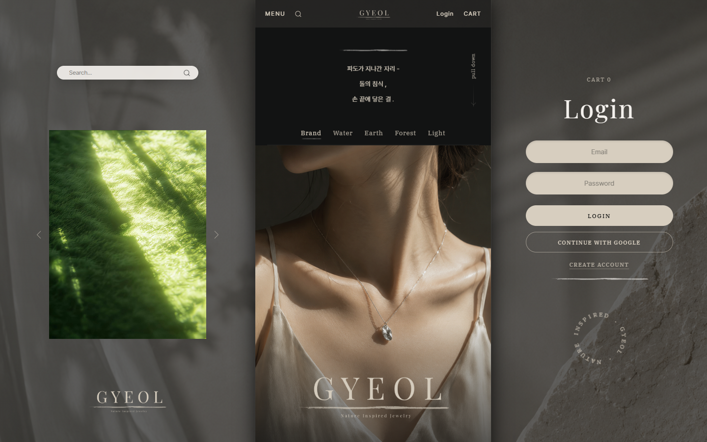
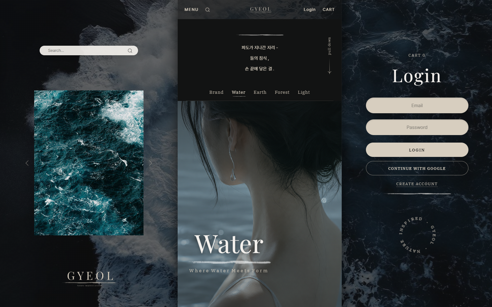
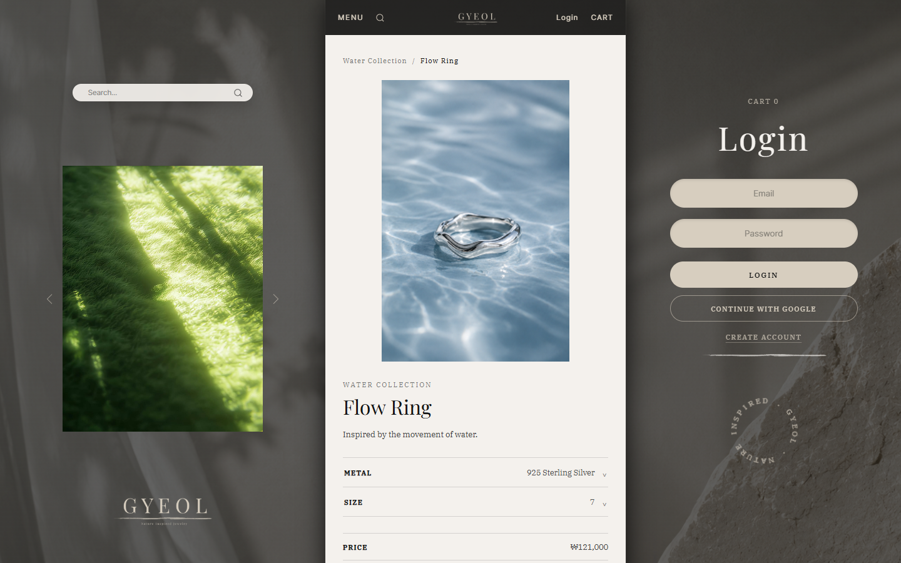
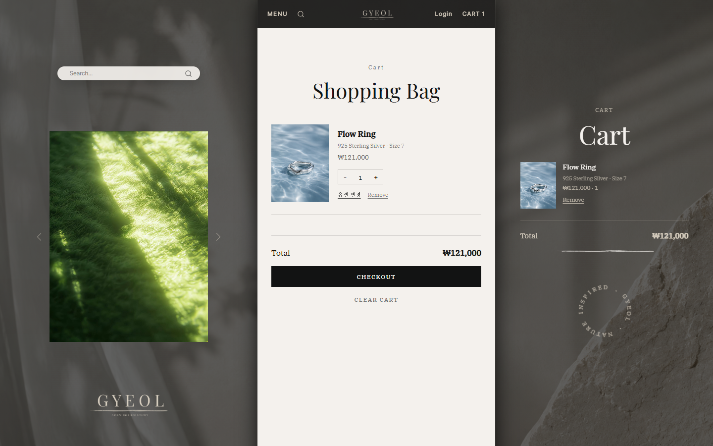
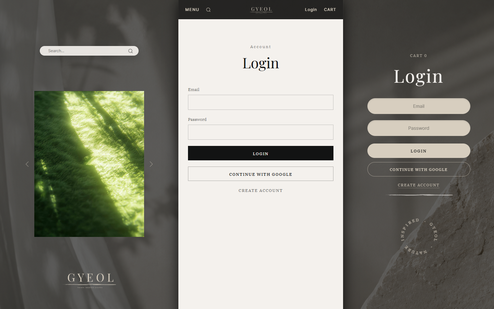
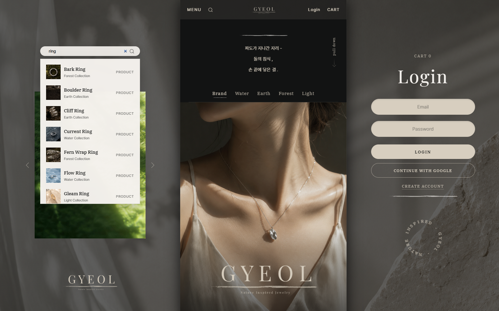

# 💍 GYEOL (결) — Nature Inspired Jewelry

> 물 · 땅 · 숲 · 빛, 자연의 결을 담은 주얼리 브랜드 이커머스 웹앱

[](https://my-app-three-eosin-90.vercel.app)
[](https://react.dev)
[](https://vite.dev)
[](https://developer.mozilla.org/ko/docs/Web/JavaScript)

---

## 📌 프로젝트 소개

<!-- 한두 줄로 프로젝트가 무엇인지, 왜 만들었는지 설명 -->

**React + Vite**로 제작한 자연 영감 주얼리 브랜드 **GYEOL**의 이커머스 웹앱입니다.  
Water / Earth / Forest / Light 4개의 자연 테마 컬렉션을 GSAP · Motion 인터랙션으로 표현하고, Firebase 인증과 Polar 결제를 연동해 실제 쇼핑몰 수준의 구매 흐름을 구현했습니다.

**→ [my-app-three-eosin-90.vercel.app](https://my-app-three-eosin-90.vercel.app)**

---

## 🖼️ 미리보기

<!-- 메인 화면 스크린샷. 필요 시 컬렉션별 이미지 추가 -->

| Main | Collection |
|:---:|:---:|
|  |  |
| 메인 페이지 | 컬렉션 페이지 |

---

## ⚠️ 주의사항

<!-- 프로젝트 사용·열람 시 주의할 점 -->

- Firebase API 키는 환경 변수(`VITE_FIREBASE_*`)로 관리합니다. 직접 실행 시 `.env.local`에 본인 키를 입력하세요.
- 결제는 Polar API를 사용하며 `POLAR_ACCESS_TOKEN` 설정과 Polar 대시보드에 **"GYEOL Order"** 커스텀 상품 등록이 필요합니다.
- 이 프로젝트는 포트폴리오 목적의 가상 브랜드 작업물입니다.

---

## 📋 프로젝트 정보

<!-- 팀 프로젝트라면 팀원별로 행 추가 -->

| 항목 | 내용 |
|:---:|:---|
| 담당 역할 | 기획 / 디자인 / 퍼블리싱 / 기능 구현 |
| 작업 기간 | 2026.xx ~ 2026.xx (x주) |
| 기여도 | 100% (개인 프로젝트) |

---

## 🛠️ 기술 스택

<!-- 사용한 기술을 레이어별로 분류 -->

**Frontend**


**Backend / 서비스**


**빌드 / 배포**


| 기술 | 용도 |
|:---|:---|
| Firebase Authentication | 이메일 / Google 소셜 로그인 |
| Firebase Firestore | 로그인 사용자 장바구니 실시간 저장·동기화 |
| Polar Checkout API | 주문 결제 (Vercel Serverless Functions 경유) |
| GSAP · Motion | 페이지 전환 및 스크롤 인터랙션 |

---

## 🤖 AI 활용

### 사용한 AI 도구

<!-- 사용한 AI 도구 목록 -->

- Claude (Anthropic)

### AI 활용 내용

<!-- AI로 생성하거나 도움받은 부분 -->

- [ ] 코드 리뷰 및 버그 디버깅
- [ ] 모바일 터치 인터랙션(two-tap hover) 개선
- [ ] 반응형 레이아웃 CSS 초안 생성

### 직접 구현한 내용

<!-- AI 없이 직접 설계·구현한 핵심 로직 -->

- [ ] 전체 UI/UX 기획 및 디자인 (브랜드 콘셉트 · 컬렉션 구성)
- [ ] Firebase 인증 · 장바구니 연동 로직
- [ ] 상품 데이터 구조 및 검색 인덱스 설계

---

## 🔗 프로젝트 링크

<!-- 관련 링크 모음 -->

| 구분 | 링크 |
|:---|:---|
| 배포 사이트 | [my-app-three-eosin-90.vercel.app](https://my-app-three-eosin-90.vercel.app) |
| GitHub | [github.com/Sonwoosuk/GYEOL](https://github.com/Sonwoosuk/GYEOL) |
| 기획서 / 노션 | — |
| 디자인 (Figma) | — |

---

## 📖 프로젝트 개요

<!-- 기획 배경, 목표, 타겟 사용자를 간략히 서술 -->

GYEOL(결)은 물 · 땅 · 숲 · 빛, 자연의 결에서 영감을 받은 가상의 주얼리 브랜드입니다.  
단순한 상품 나열이 아니라 각 컬렉션의 자연 테마를 영상 · 시 · 인터랙션으로 풀어내는 브랜드 경험 중심의 쇼핑몰을 목표로 했습니다.

- **목표**: 브랜드 감성과 실제 구매 흐름(장바구니 → 결제)을 모두 갖춘 이커머스 구현
- **타겟**: 자연주의 감성의 주얼리에 관심 있는 2030 고객
- **핵심 가치**: 자연 · 절제된 아름다움 · 몰입감

---

## ✨ 주요 기능

<table>
  <tr>
    <td align="center"><br><b>메인 히어로 인터랙션</b></td>
    <td align="center"><br><b>4개 자연 테마 컬렉션</b></td>
    <td align="center"><br><b>상품 상세 (메탈·사이즈 옵션)</b></td>
  </tr>
  <tr>
    <td align="center"><br><b>장바구니 & Polar 결제</b></td>
    <td align="center"><br><b>이메일 / Google 로그인</b></td>
    <td align="center"><br><b>전체 상품 검색</b></td>
  </tr>
</table>

---

## 🔧 핵심 구현 내용

<!-- 기술적으로 공들인 부분을 구체적으로 작성 -->

**1. 게스트 장바구니 → Firestore 병합**

```javascript
// 예시: 핵심 로직 발췌
// 실제 코드는 src/context/CartContext.jsx 참고
const guestItems = JSON.parse(localStorage.getItem('gyeol-cart') || '[]')
if (guestItems.length > 0) {
  const batch = writeBatch(firebaseDb)
  guestItems.forEach((item) => {
    batch.set(doc(cartRef, item.cartId), { ...item, updatedAt: serverTimestamp() }, { merge: true })
  })
  batch.commit().then(() => localStorage.removeItem('gyeol-cart'))
}
```

- 비로그인 시 `localStorage`에 담고, 로그인하면 Firestore로 일괄 병합 후 `onSnapshot`으로 실시간 동기화

**2. Polar 결제 연동 (Serverless)**

- `api/checkout.js`에서 서버 측 금액 재계산 후 Polar 체크아웃 세션 생성 → 클라이언트 금액 조작 방지
- 결제 완료 시 `/success?checkout_id={CHECKOUT_ID}`로 리다이렉트

**3. 모바일 터치 인터랙션 (two-tap hover)**

- `useTouchHover` 커스텀 훅으로 터치 기기에서 첫 탭은 hover, 두 번째 탭은 이동으로 동작
- 배너 첫 탭 사라짐, pull-down 프리즈 등 모바일 이슈를 터치 이벤트 추적으로 해결

---

## 🚧 Trouble Shooting

<!-- 개발 중 마주친 문제와 해결 과정 -->

| 문제 | 원인 | 해결 |
|:---|:---|:---|
| 결제 요청 오류 | `/api` 경로 앞에 보이지 않는 공백(투명 문자)이 섞여 요청 URL이 잘못됨 | 경로 문자열의 공백 제거 후 정상 호출 확인 |
| 모바일 첫 탭에 배너 사라짐 | 터치 기기에서 hover와 클릭 동시 발생 | two-tap hover 패턴(`useTouchHover`) 도입 |
| 모바일 pull-down 시 화면 프리즈 | 터치 드래그 상태 미추적 | `touchmove`로 드래그 추적 후 release 시 원복 |
| 영상 패널이 서브 내비를 가림 | 모바일 레이아웃 z-index·높이 계산 오류 | 패널 높이 재계산 및 레이어 순서 정리 |
| 로그인/회원가입 오류 | form submit 이벤트 충돌 | 버튼 클릭 핸들러 방식으로 교체 |

---

## ⚡ 성능 최적화

<!-- 성능 개선 작업 내용과 수치 -->

- [ ] 컬렉션 이미지 `loading="lazy"` 적용으로 초기 로드 시간 단축
- [ ] 상품 데이터 JSON 분리(`src/data/`)로 페이지별 필요 데이터만 로드
- [ ] Vite 프로덕션 빌드 코드 스플리팅

| 항목 | 개선 전 | 개선 후 |
|:---:|:---:|:---:|
| Lighthouse Performance | — | — |
| First Contentful Paint | — | — |

---

## 🗂️ 데이터 구조

<!-- Firestore, localStorage 등 데이터 스키마 -->

**Firestore — 장바구니 (`users/{uid}/cart/{cartId}`)**

```json
{
  "cartId": "ring-01__silver__12",
  "name": "Water Ring",
  "price": 128000,
  "image": "/images/water/rings-1.png",
  "selectedMetal": "Silver",
  "selectedSize": "12",
  "quantity": 1,
  "updatedAt": "timestamp"
}
```

**localStorage — 게스트 장바구니**

```
key: "gyeol-cart"
value: 장바구니 아이템 배열 (JSON)
```

---

## 📁 프로젝트 구조

```
my-app/
├── api/                       # Vercel Serverless Functions
│   ├── checkout.js            # Polar 체크아웃 세션 생성
│   ├── catalog.js             # 서버 측 주문 금액 계산
│   ├── products.js            # 상품 API
│   └── _polar.js              # Polar API 클라이언트
│
├── src/
│   ├── pages/                 # 메인 · 컬렉션 4종 · 상품상세 · 장바구니 · 로그인/회원가입 · 마이페이지 · 결제완료
│   ├── components/            # 헤더 · 사이드메뉴 · 검색 · 푸터 등 공용 컴포넌트
│   ├── context/               # AuthContext · CartContext
│   ├── lib/                   # firebase · checkout · 검색 인덱스 · useTouchHover
│   └── data/                  # 상품/컬렉션/테마 JSON 데이터
│
├── public/images/             # 컬렉션별 상품 이미지
├── vercel.json                # SPA 라우팅 rewrite 설정
└── vite.config.js
```

---

## 🚀 실행 방법

```bash
# 1. 레포지토리 클론
git clone https://github.com/Sonwoosuk/GYEOL.git

# 2. 의존성 설치
cd GYEOL/my-app
npm install

# 3. 개발 서버 실행
npm run dev
```

> Firebase · Polar 기능은 환경 변수(`VITE_FIREBASE_*`, `POLAR_ACCESS_TOKEN`) 설정 없이는 동작하지 않습니다. ⚠️

---

## 📝 개선 예정

<!-- 앞으로 추가하거나 개선할 기능 목록 -->

- [ ] 주문 내역 조회 (마이페이지)
- [ ] 위시리스트 기능
- [ ] SEO 메타태그 최적화
- [ ] 접근성 (a11y) 개선

---

## 💡 프로젝트를 통해 배운 점

<!-- 기술적으로 새롭게 알게 된 점, 성장한 부분 -->

- Firestore `onSnapshot`과 `writeBatch`를 활용한 게스트 → 회원 장바구니 병합 패턴
- 결제 금액을 서버(Serverless Function)에서 재계산해야 하는 이유와 구현 방법
- 터치 기기와 데스크톱의 hover 동작 차이를 커스텀 훅으로 통합하는 방법

---

## 🪞 프로젝트 회고

<!-- 잘된 점, 아쉬운 점, 다음에 시도할 것 -->

**잘된 점**
- 물, 땅, 숲, 빛이라는 컨셉을 처음에 확실히 잡아두니 페이지를 만들 때마다 디자인 기준이 명확해서 헤매지 않았다
- 장바구니에서 결제까지 이어지는 흐름을 끝까지 붙여본 게 처음이었는데, 중간에 포기하지 않고 완성했다
- 모바일에서 터치 버그가 계속 나와서 고생했지만, 대충 덮지 않고 원인을 찾아가며 고친 게 남는 경험이 됐다

**아쉬운 점**
- 상품 하나 고치려면 JSON 수정하고 다시 배포해야 하는 구조라 뒤로 갈수록 번거로웠다
- 결제 API 경로에 눈에 보이지 않는 공백 문자가 섞여 있어서 원인을 찾는 데 많은 시간을 썼다. 코드는 멀쩡해 보이는데 결제만 계속 실패해서 한참을 헤맸다
- 결제는 되는데 주문 내역을 다시 볼 수 있는 페이지까지는 못 만들었다

**다음에 시도할 것**
- 상품 데이터를 Firestore로 옮겨서 배포 없이 수정할 수 있게 바꿔보기
- 다음 프로젝트는 처음부터 TypeScript로 시작하기
- Lighthouse 점수를 실제로 측정해보고 이미지 최적화 전후를 비교해보기
- 코드를 복사해서 붙여넣기보다 직접 작성하기. 보이지 않는 문자가 함께 들어오면 원인을 찾는 데 몇 배의 시간이 걸린다는 걸 배웠다

---

## 📄 License

This project is for portfolio purposes only.  
GYEOL is a fictional brand created for this project.

<!-- 오픈소스로 공개할 경우 아래 라이선스 뱃지 사용 -->
<!-- [](LICENSE) -->
